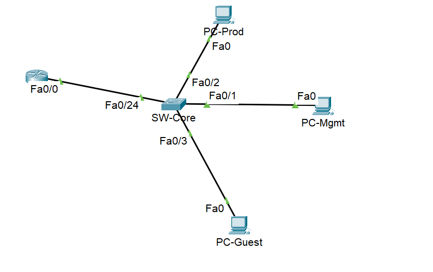
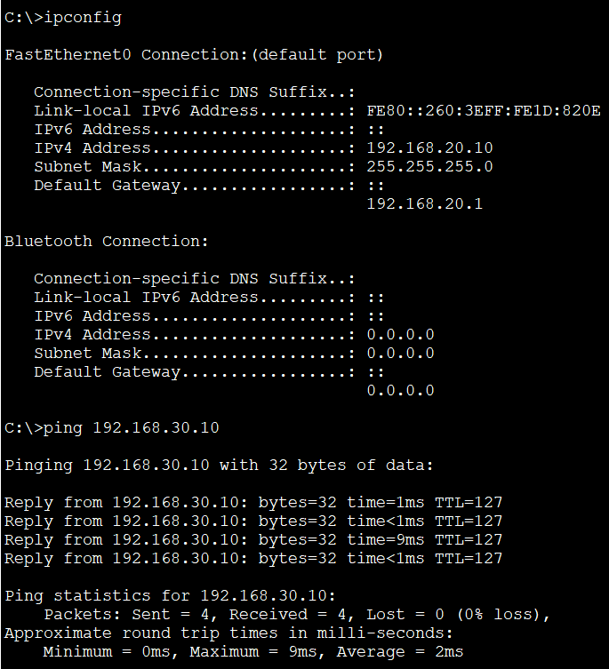

# VLAN Simulation Lab (Packet Tracer)

## 🎯 Objective
Design and configure:
- 3 VLANs: Management, Production, Guest
- Trunk port between switch and router
- Inter-VLAN routing (Router-on-a-Stick)
- Test connectivity across VLANs

## 🛠️ Topology

Devices:
- Router: R1
- Switch: SW-Core
- PCs: PC-Mgmt, PC-Prod, PC-Guest

## 🧩 VLANs
| VLAN | Name        | Subnet            | Gateway          |
|------|-------------|-------------------|------------------|
| 10   | Management  | 192.168.10.0/24   | 192.168.10.1     |
| 20   | Production  | 192.168.20.0/24   | 192.168.20.1     |
| 30   | Guest       | 192.168.30.0/24   | 192.168.30.1     |

## ⚙️ Configuration Highlights
- Switch ports assigned per VLAN
- Router subinterfaces with 802.1Q encapsulation
- Trunk on Fa0/24

## ✅ Testing
All devices can ping each other across VLANs.

## 💾 File
- `vlan-lab.pkt`: Packet Tracer file
